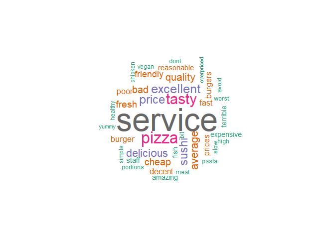

TripAdvisor restaurant reviews
================

## 1. Data Cleaning
----------------

In this section, the dataset with the reviews was imported and all the punctuation that the reviews had has been removed. Furthermore, the reviews section contained a date field which has been moved to a new column with the name "Date". For the separation of the "Review" and the "Date" fields in the new dataframe, the library "tidyverse" was used. The data cleaning was performed in a "for" iteration which deletes all the punctuations from the reviews.

``` r
setwd("./data/")
library(dplyr)
library(tidyverse)
# Import the data
mydata <- read.csv("TA_restaurants_curated.csv", stringsAsFactors=FALSE)

# Select the useful data from the file
useful_data <- mydata %>% select(City, Cuisine.Style, Reviews)

# Clean the data 
useful_data <- separate(useful_data, Reviews, c("Review","Date"), sep = "],")


for (i in 1:length(useful_data[,1])) {
  useful_data[i,3] <- tolower(useful_data[i,3])
  useful_data[i,3] <- gsub("[[:punct:]]", "",useful_data[i,3])
  useful_data[i,2] <- gsub("\'", "",useful_data[i,2])
  useful_data[i,2] <- gsub("\\[", "",useful_data[i,2])
  useful_data[i,2] <- gsub("\\]", "",useful_data[i,2])
}

# Save the data that are going to be used in the "clean_data" variable
clean_data <- useful_data[which(!useful_data$Review == "" & !useful_data$Cuisine.Style == ""), ]

write.csv(clean_data,'clean_data.csv')
```

## 2. Question1: What is the opinion of people about restaurants?
--------------------------------------------------------------

To answer this question we performed a sentiment analysis on the clean data from the previous step. Also, a lexicon containing the weighted average of words was created for the sentiment analysis. The formulas and the calculations that have been done to create the lexicon are provided in the report paper. The idea behind this implementation was to create a lexicon that will not weigh all the words in the same way. In that way, the results will be more accurate as some words have more weight than others.

The sentiment analysis was implemented by splitting each review into words and then comparing each word with the ones that exist in the lexicon. In case we had a match, the index of the word was saved in order to calculate the overall review score later by adding all the weights of the words that have been matched.

To analyse the results, the words with the positive score were categorized as "Positive", the ones with a negative score as "Negative", and the reviews with score equal to zero as "Neutral". To visualise this information a bar plot was created presenting the number of negative, positive and neutral reviews.

``` r
setwd("./data/")
#loading the library
library(plyr)
library(dplyr)
library(stringr)
library(ggplot2)
library(scales)

# Import the data
clean_data <- read.csv("clean_data.csv", stringsAsFactors=FALSE)

clean_data.Review <- clean_data['Review']
clean_data.Review <- sapply(clean_data.Review,function(row) iconv(row, "latin1", "ASCII", sub=""))

#Reading the Lexicon
lexicon_data <- read.csv("lexicon.csv",  sep = "\t", stringsAsFactors=FALSE)
# Slpit the Lexicon into 2 colums one for the word and one for the Score of the word
clean_lexicon <- data.frame(do.call('rbind', strsplit(as.character(lexicon_data$Word.Score),'\t',fixed=TRUE)))
colnames(clean_lexicon) <- c("Word", "Score")
# Transform the Score row into numeric format for easier manipulation.
clean_lexicon$Score <- as.numeric(as.character(clean_lexicon$Score))

#function to calculate sentiment score
score.sentiment <- function(sentences, lexicon, .progress='none')
{
  
  # create simple array of scores with laply
  scores <- laply(sentences,
                  function(sentence, lexicon)
                  {
                    
                    # split sentence into words with str_split (stringr package)
                    word.list <- str_split(sentence, "\\s+")
                    words <- unlist(word.list)
                    
                    # compare words to the dictionaries and save their index
                    matches <- match(words, as.character(clean_lexicon$Word))
                    # delete NAs if a word is not in the lexicon
                    matches <- na.omit(matches)
                    # calculate reviews score based on the words of the lexicon
                    # the lexicon has both possitive and negative scores therefore, we don't have to calculate
                    # the number of possitive  and negative words.
                    score <- sum(clean_lexicon[matches,2])
                    
                    
                    return(score)
                  }, lexicon, .progress=.progress )
  # data frame with scores for each sentence
  scores.df <- data.frame(text=sentences, score=scores)
  return(scores.df)
}
#sentiment score
scores_reviews <- score.sentiment(clean_data.Review, lexicon = clean_lexicon, .progress='text')


#Summary of the sentiment scores
summary(scores_reviews)

scores_reviews$score_chr <- ifelse(scores_reviews$score < 0,'Negative', ifelse(scores_reviews$score > 0, 'Positive', 'Neutral'))


#Convert score_chr to factor for visualizations
scores_reviews$score_chr <- as.factor(scores_reviews$score_chr)
names(scores_reviews)[3]<-paste("Sentiment")  

#plot to show number of negative, positive and neutral comments
ggplot(scores_reviews, aes(x=Sentiment, fill=Sentiment))+ geom_bar(aes(y = (..count..)/sum(..count..))) + 
  scale_y_continuous(labels = percent)+labs(y="Score")+
  theme(text =element_text(size=15))+theme(axis.text = element_text(size=15))+ theme(legend.position="none")+ coord_cartesian(ylim=c(0,1)) + scale_fill_manual(values=c("firebrick1", "grey50", "limeGREEN"))
```


## 3. Question2: What is the best type of food based on the polarity of the reviews?
---------------------------------------------------------------------------------

In this section, the information from the sentiment analysis was used, along with the cuisine types of the restaurants in the reviews, in order to learn which is the best type of restaurant according to our data. To extract this information, we used the reviews' scores from the sentiment analysis. The cuisine types were extracted from the appropriate column that each restaurant had in TripAdvisor.

To calculate the score of each restaurant type a dataframe to store this score was created. These scores were calculated by iterating through the reviews and saving the index of the review score for each restaurant type that was found. In the next step, we found all the cuisine type matches and the individual cuisine score was calculated by adding the scores that have been found for this particular cuisine type. For example, if we have a review with a score of 4 for Italian cuisine and another one with a score of -1 for the same cuisine then the final score was calculated to be 3.

To visualise this information, the library "ggplot2" was used and a bar plot with the top 10 cuisine types was generated. The pipeline calculated more than 10 cuisine types scores but for presentation purposes, only the top 10 will be presented.

``` r
setwd("./data/")
#Import the cuisine types based on Regions. Ex. Italian, American, Greek, Indian
cuisine_style <- readLines("cuisine_type.txt")
#Instantiate a dataframe for Cuisine Scores
df<- data.frame(cuisine_style)
#Initialize to zero all the scores
df$cuisineScore<-0

# Add the indexing column "X" in scores_reviews\
# This will be used to join scores_reviews with clean_data table.
scores_reviews$X <- seq.int(nrow(scores_reviews))
# Join tables of reviews and scores based on column "X"
all_data<-merge(clean_data,scores_reviews,by ="X", all.x = TRUE )

# Loop through all the reviews
for (i in 1:nrow(all_data)){
  
  sentence<- all_data$Cuisine.Style[i]
  # split sentence into words with str_split (stringr package)
  word.list<-str_split(sentence,"\\s+")
  words<- unlist(word.list)
  
  # find the cuisine types of current review
  typesMatch<-match(words,cuisine_style)
  # Discard N/A values
  typesMatch <- na.omit(typesMatch)
  
  # Loop thought the cuisine types that found in this review
  for(var in typesMatch){
    temp<- df$cuisineScore[var]
    # Avoid NA cases
    if(!is.na(as.numeric(all_data$score[i]) + as.numeric(temp)))
    {
      # Add score value to the corresponding cuisine type
      df$cuisineScore[var]<-as.numeric(all_data$score[i]) + as.numeric(temp)
    }
  }
}

# Get Top 10 cuisines
topScores<-top_n(df, 10, df$cuisineScore)
# Plot the scores of Top 10 cuisines
p <- ggplot(topScores, aes(x=topScores$cuisine_style,y = topScores$cuisineScore , fill=cuisine_style)) +geom_bar(stat = "identity")+theme(plot.title = element_text(hjust = 0.5))
p + labs(subtitle = NULL) + labs(x = "Cuisine Style") + labs(y = "Cuisine Score") + labs(title = "Top 10 Cuisines") 
```


## 4. Question3: What do people talk about most in their comments?
---------------------------------------------------------------

To understand the connection between the words in the reviews and to find what people talk about most in each topic, a Latent Dirichlet Allocation (LDA) model was used. To train the model, we used words from the customers' reviews. In order to have better results and reduce the amount of "noise" that can be caused by stop words, uncommon, misspelled words and words that exist on a large scale, three filters were applied.

The first filter removed all the stopwords with the help of the "tm" package. The second filter excluded the words that had a frequency of less than five. The last filter removed all the words with a frequency greater than 10.000. By analysing the reviews some words like "food" were detected in almost every review. That happened because all the data was about restaurants reviews, therefore, a big portion of users used that word, causing problems in the identification of the groups. Then, the LDA model categorized the words into four groups based on how commonly these words appear in the reviews.

To recognise which words the people are using most, the probability of each word being in a specific topic was calculated. This has been done by measuring the frequency of a word in a topic divided by the total number of words in that topic. To visualise this information, word clouds were produced for each topic showing the most common words that people used in each category.

To automate the categorisation of each group, four lexicons containing words about food, drinks, prices and service words were created. To categorise each group, the probability of a word to belong in each group was calculated by dividing the frequency of a word in a group by the total number of appearances of this word in the corpus. Then, only if a word has 90% or more probability to be in this group, it was considered as a word that can define the category of this group. This implementation helped to filter the words with low probability, in order to define the category of each group. This method produced a 4x4 table that contains the four groups from the LDA model and the percentage of each group belonging in each of the four categories based on the words that have 90% or more probability to be in each group.

``` r
setwd("./data/")
library(LDAvis)
library(tm)
library(lda)
library(wordcloud)


stop_words <- stopwords("SMART")

Dataset2<-read.csv("clean_data.csv")
tweet <- Dataset2$Review

tweet <- sapply(tweet, function(x) iconv(x, to='UTF-8', sub='byte'))

tweet= gsub("[[:punct:]]", "", tweet)
tweet = gsub("[[:digit:]]", "", tweet)
tweet= gsub("http\\w+", "", tweet)
tweet = gsub("[ \t]{2,}", "", tweet)
tweet= gsub("^\\s+|\\s+$", "", tweet) 
#ref: ( Hicks , 2014) 

#get rid of unnecessary spaces
tweet <- str_replace_all(tweet," "," ")

tweet <- str_replace(tweet,"RT @[a-z,A-Z]*: ","")
# Get rid of hashtags
tweet <- str_replace_all(tweet,"#[a-z,A-Z]*","")
# Get rid of references to other screennames
tweet<- str_replace_all(tweet,"@[a-z,A-Z]*","")  

# tokenize on space and output as a list:
doc.list <- strsplit(tweet, "[[:space:]]+")

# compute the table of terms:
term.table <- table(unlist(doc.list))
term.table <- sort(term.table, decreasing = TRUE)

# remove terms that are stop words or occur fewer than 5 times:
del <- names(term.table) %in% stop_words | term.table < 5 | term.table > 10000
term.table <- term.table[!del]
vocab <- names(term.table)

# now put the documents into the format required by the lda package:
get.terms <- function(x) {
  index <- match(x, vocab)
  index <- index[!is.na(index)]
  rbind(as.integer(index - 1), as.integer(rep(1, length(index))))
}
documents <- lapply(doc.list, get.terms)

# Compute some statistics related to the data set:
D <- length(documents)  # number of documents 
W <- length(vocab)  # number of terms in the vocab 
doc.length <- sapply(documents, function(x) sum(x[2, ]))  # number of tokens per document 
N <- sum(doc.length)  # total number of tokens in the data 
term.frequency <- as.integer(term.table)  # frequencies of terms in the corpus 


# MCMC and model tuning parameters:
K <- 20
G <- 5000
alpha <- 0.02
eta <- 0.02

# Fit the model:
library(lda)
set.seed(357)
fit <- lda.collapsed.gibbs.sampler(documents = documents, K = 4, vocab = vocab, 
                                   num.iterations = 200, alpha = 0.5, eta=0.5,
                                   initial = NULL, burnin = 0,
                                   compute.log.likelihood = TRUE)


# Calculate the probability of a word to be included in each topic
Prob_word_in_topic <- apply(fit$topics, 2, function(data){
  data/sum(data)
})
# Calculate the probability of a word to be in a specific topic
Prob_of_word <- t(apply(fit$topics, 1, function(data){
  data/sum(data)
}))
# Import the lexicons
price_words <- readLines("price_words.txt")
service_words <- readLines("service_words.txt")
food_words <- read.csv("food-lexicon.csv", stringsAsFactors=FALSE)
food_words <- as.matrix(food_words)
drink_words <- read.csv("drink_lexicon.csv", stringsAsFactors=FALSE)
drink_words <- as.matrix(drink_words)
service_words <- unique(service_words)
table <- data.frame(Food = integer(), Drink = integer(), Staff = integer(), Price = integer())
# Identify the topics based on the lexicons
for (i in 1:length(Prob_word_in_topic[,1])){
  index <- which(Prob_word_in_topic[i,] >0.90)
  words <- colnames(Prob_word_in_topic[,index])
  temp <- data.frame(Food = integer(), Drink = integer(), Staff = integer(), Price = integer())
  Food <- sum(colSums(sapply(food_words, function(x,w) str_count(w,x), w = words)))
  Drink <- sum(colSums(sapply(drink_words, function(x,w) str_count(w,x), w = words)))
  Staff <- sum(colSums(sapply(service_words, function(x,w) str_count(w,x), w = words)))
  Price <- sum(colSums(sapply(price_words, function(x,w) str_count(w,x), w = words)))
  temp <- data.frame(Food = Food, Drink = Drink, Staff = Staff, Price = Price)
  table <- rbind(table, temp)
}

topic_identification <- t(apply(table, 1, function(data){
  data/sum(data)
}))
topic_identification <- as.data.frame(topic_identification)

#plots to show the topic identification
df <- data.frame(var=colnames(topic_identification), nums=t(topic_identification[1,]))
plot1 <- ggplot(df, aes(x=var, y=X1)) + geom_bar(stat = "identity", fill="steelblue") + theme_minimal() + labs(y="Score", x="Group type")+ coord_cartesian(ylim=c(0,0.8)) +
  theme(axis.text = element_text(size=12)) + theme(text =element_text(size=15)) + labs(title = "Group 1") +
  geom_text(aes(label = round(X1, digits = 3)), vjust = -0.5, size = 3.5) 

df <- data.frame(var=colnames(topic_identification), nums=t(topic_identification[2,]))
plot2 <- ggplot(df, aes(x=var, y=X2)) + geom_bar(stat = "identity", fill="steelblue") + theme_minimal() + labs(y="Score", x="Group type")+ coord_cartesian(ylim=c(0,0.8)) +
  theme(axis.text = element_text(size=12)) + theme(text =element_text(size=15)) + labs(title = "Group 2") +
  geom_text(aes(label = round(X2, digits = 3)), vjust = -0.5, size = 3.5) 

df <- data.frame(var=colnames(topic_identification), nums=t(topic_identification[3,]))
plot3 <- ggplot(df, aes(x=var, y=X3)) + geom_bar(stat = "identity", fill="steelblue") + theme_minimal() + labs(y="Score", x="Group type")+ coord_cartesian(ylim=c(0,0.8)) +
  theme(axis.text = element_text(size=12)) + theme(text =element_text(size=15)) + labs(title = "Group 3") +
  geom_text(aes(label = round(X3, digits = 3)), vjust = -0.5, size = 3.5) 

df <- data.frame(var=colnames(topic_identification), nums=t(topic_identification[4,]))
plot4 <- ggplot(df, aes(x=var, y=X4)) + geom_bar(stat = "identity", fill="steelblue") + theme_minimal() + labs(y="Score", x="Group type")+ coord_cartesian(ylim=c(0,0.8)) +
  theme(axis.text = element_text(size=12)) + theme(text =element_text(size=15)) + labs(title = "Group 4") +
  geom_text(aes(label = round(X4, digits = 3)), vjust = -0.5, size = 3.5) 

library(gridExtra)
grid.arrange(plot1, plot2, plot3, plot4, nrow=2, ncol=2)
```


``` r
# Word Cloud for Group 1. This group represents most Prices and Staff. The word cloud shows what words 
# the people uses more when they are talking for those topics.
word_frame <- data.frame(Word = colnames(Prob_of_word), Frequency = Prob_of_word[1,])
wordcloud(words = word_frame$Word, freq = word_frame$Frequency, min.freq = 0.9,
          max.words=40, random.order=FALSE, rot.per=0.35, main="Title",
          colors=brewer.pal(8, "Dark2"))
```


``` r
# Word Cloud for Group 2. This group represents most Drinks, Prices and Staff. The word cloud shows what words 
# the people uses more when they are talking for those topics.
word_frame <- data.frame(Word = colnames(Prob_of_word), Frequency = Prob_of_word[2,])
wordcloud(words = word_frame$Word, freq = word_frame$Frequency, min.freq = 0.9,
          max.words=40, random.order=FALSE, rot.per=0.35, main="Title",
          colors=brewer.pal(8, "Dark2"))
```


``` r
# Word Cloud for Group 3. This group represents most Foods and Prices. The word cloud shows what words 
# the people uses more when they are talking for those topics.
word_frame <- data.frame(Word = colnames(Prob_of_word), Frequency = Prob_of_word[3,])
wordcloud(words = word_frame$Word, freq = word_frame$Frequency, min.freq = 0.9,
          max.words=40, random.order=FALSE, rot.per=0.35, main="Title",
          colors=brewer.pal(8, "Dark2"))
```



``` r
# Word Cloud for Group 4. This group represents most Drinks. The word cloud shows what words 
# the people uses more when they are talking for this topic.
word_frame <- data.frame(Word = colnames(Prob_of_word), Frequency = Prob_of_word[4,])
wordcloud(words = word_frame$Word, freq = word_frame$Frequency, min.freq = 0.9,
          max.words=40, random.order=FALSE, rot.per=0.35, main="Title",
          colors=brewer.pal(8, "Dark2"))
```


``` r
theta <- t(apply(fit$document_sums + 0.5, 2, function(x) x/sum(x)))
phi <- t(apply(t(fit$topics) + 0.5, 2, function(x) x/sum(x)))


tweetvis <- list(phi = phi,
                 theta = theta,
                 doc.length = doc.length,
                 vocab = vocab,
                 term.frequency = term.frequency)


# create the JSON object to feed the visualization:
json <- createJSON(phi = tweetvis$phi, 
                   theta = tweetvis$theta, 
                   doc.length = tweetvis$doc.length, 
                   vocab = tweetvis$vocab, 
                   term.frequency = tweetvis$term.frequency)
serVis(json, out.dir = tempfile(), open.browser = interactive())
```
